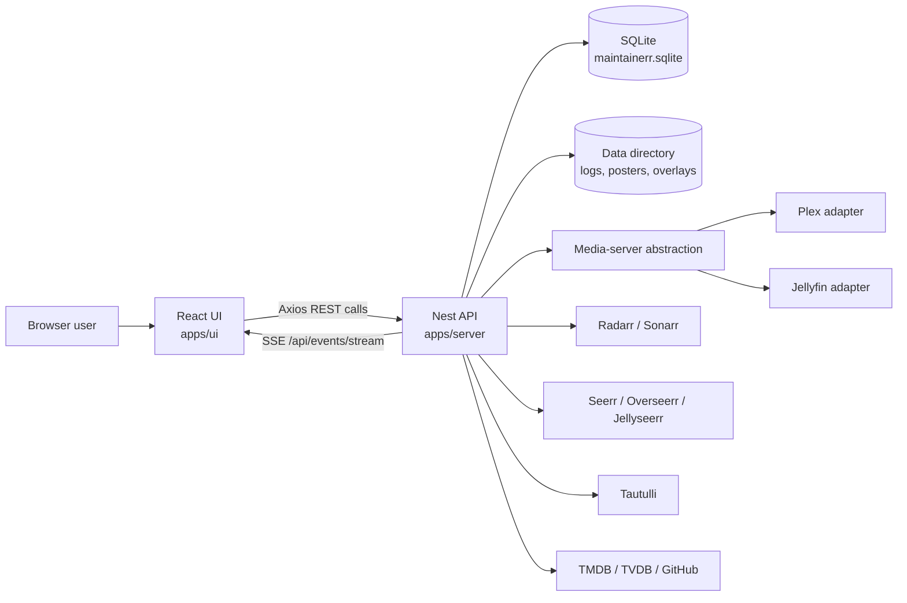

# Architecture Overview

This document gives contributors a fast map of Maintainerr's architecture. It
is tool-neutral and should support manual development, IDE workflows, and
automation equally. It is intentionally high level: use it to find the right
area of the codebase, then follow the local module, tests, and contracts for
exact behaviour.

Last updated: 2026-04-29.

## Project Structure

Maintainerr is a TypeScript monorepo managed with Turborepo and Yarn
workspaces.

```text
Maintainerr/
|-- apps/
|   |-- server/              # Nest API, jobs, integrations, persistence, logs
|   `-- ui/                  # Vite React UI, routes, client API calls
|-- packages/
|   `-- contracts/           # Shared DTOs, Zod schemas, enums, and types
|-- docs/                    # Feature-level technical notes
|-- docker/                  # Docker helper configuration
|-- tools/                   # Release and maintenance scripts
|-- Dockerfile               # Multi-stage production image
|-- README.md                # Product overview and installation entry point
|-- CONTRIBUTING.md          # Contributor setup and process
`-- turbo.json               # Workspace task graph
```

## High-Level System Flow



In production, the Nest server also serves the built UI from
`apps/server/dist/ui`. In development, Vite and Nest run through the workspace
`yarn dev` task.

## Core Components

### UI

`apps/ui` owns client routing, UI state, and API calls. It uses Vite, React,
React Router, TanStack Query, React Hook Form, TailwindCSS, and Headless UI.

- `src/router.tsx` is the route source of truth. It uses eager shell routes and
  lazy feature pages with preload support.
- `src/utils/ApiHandler.tsx` centralises API base path handling and Axios REST
  helpers.
- `src/contexts/events-context.tsx` opens the reconnecting SSE stream.
- `src/contexts/taskstatus-context.tsx` combines initial task status queries
  with live rule and collection handler events.
- `src/components/Common/` contains shared UI primitives. Prefer existing
  buttons, loading boundaries, modals, tables, and feedback patterns before
  adding new ones.

### Server

`apps/server` owns the Nest application, background jobs, persistence, external
integrations, and production static serving.

- `src/main.ts` bootstraps Nest, validates the data directory, configures base
  path handling, Swagger, CORS, logging, and graceful shutdown.
- `src/app/app.module.ts` wires TypeORM, events, static serving, and feature
  modules.
- `src/modules/settings/` stores user configuration and coordinates media
  server switching.
- `src/modules/api/media-server/` provides the server-agnostic media server
  interface, factory, controller, and shared utilities.
- `src/modules/api/media-server/plex/` and
  `src/modules/api/media-server/jellyfin/` contain server-specific adapters,
  constants, mappers, caching, and SDK/API calls.
- `src/modules/rules/` evaluates rule groups against media-server and external
  service data.
- `src/modules/collections/` tracks matched media, exclusions, collection logs,
  posters, and collection handling actions.
- `src/modules/tasks/` creates and tracks scheduled jobs.
- `src/modules/events/` exposes server-sent events for rule and collection job
  progress.
- `src/modules/overlays/`, `src/modules/metadata/`,
  `src/modules/notifications/`, `src/modules/logging/`, and
  `src/modules/storage-metrics/` own their respective feature areas.

### Contracts

`packages/contracts` owns shared DTOs, Zod schemas, enums, and cross-package
types. Add request/response shapes here only when they are deliberately shared
between the UI and server. Keep new contracts minimal and validate external
input at system boundaries.

## Data Stores

Maintainerr stores local state in SQLite through TypeORM.

- Development database: `data/maintainerr.sqlite`.
- Production database: `${DATA_DIR}/maintainerr.sqlite`, defaulting to
  `/opt/data/maintainerr.sqlite`.
- TypeORM loads entities with `autoLoadEntities` and runs migrations
  automatically on server start.
- Schema changes must use the TypeORM workflow in `typeorm_instructions.txt`;
  do not hand-write SQL migrations.

The data directory also stores operational files such as logs, custom
collection posters, overlay images, original artwork backups, and other
runtime assets. The Docker image exposes `/opt/data` as a volume.

## External Integrations

Maintainerr integrates with:

- Plex and Jellyfin through the media-server abstraction.
- Radarr and Sonarr for unmonitoring, deleting, and quality profile actions.
- Seerr-compatible services for request cleanup.
- Tautulli for Plex analytics and rule data.
- TMDB and TVDB for metadata resolution.
- GitHub for release/version checks.
- Notification providers such as Discord, Slack, Telegram, Pushover, Gotify,
  ntfy, email, Pushbullet, LunaSea, and webhooks.

When changing an external integration, confirm current behaviour from the
official API documentation before coding. Keep third-party secrets in settings
or environment variables; never hard-code tokens or keys.

## Deployment and Runtime

The production Docker image builds all workspaces, focuses production
dependencies, copies the UI build into the server distribution, and starts the
Nest server through `docker/start.sh`.

Important runtime environment variables include:

- `DATA_DIR`: production data directory, default `/opt/data`.
- `UI_PORT`: HTTP listen port, default `6246`.
- `UI_HOSTNAME`: HTTP bind host, default `0.0.0.0`.
- `BASE_PATH`: optional subdirectory mount path for both API and UI serving.
- `GITHUB_TOKEN`: optional token for higher GitHub API rate limits.
- `VERSION_TAG` and `GIT_SHA`: release metadata surfaced by the app.
- `DEBUG`: influences default log level during migration seeding.

## Security Notes

- Treat configured integration tokens and API keys as secrets.
- Keep user-provided URLs and external API responses validated or normalised at
  system boundaries.
- Prefer typed DTOs and Zod schemas for request/response data.
- Avoid logging raw secrets. Use existing secret masking helpers where
  available.
- Keep destructive actions explicit: delete, unmonitor, and quality-profile
  changes should remain tied to collection/rule configuration.

## Development and Testing

Run workspace commands from the repository root.

```bash
yarn install
yarn dev
yarn lint
yarn check-types
yarn test
yarn build
```

Closest quality gates should run in this order where applicable: lint,
typecheck, tests, then build. For doc-only changes, a targeted Prettier check is
usually enough.

Testing conventions:

- Server tests use Jest, with `*.spec.ts` files near the code under
  `apps/server/src`.
- UI tests use Vitest and React Testing Library.
- Contracts use TypeScript checks and package-level linting.

See `CONTRIBUTING.md` for setup, branching, and pull request expectations.

## Architecture Guardrails

- Keep `modules/api/media-server/` server-agnostic. The shared interface,
  factory, controller, and utilities must not import Plex or Jellyfin types.
- Put Plex-specific logic under `plex/` and Jellyfin-specific logic under
  `jellyfin/`.
- Use `supportsFeature()` for conditional media-server capabilities.
- Implement every new media-server interface method for all supported media
  servers. Put partial support behind feature checks, not optional interface
  holes.
- Keep mappers focused on type conversion, not business decisions.
- Prefer shared settings feedback, loading, and button components in the UI.
- Avoid layout shift in shell and settings flows.
- Preserve established rule `name` and `humanName` conventions across media
  servers.
- Keep migrations safe, reversible, and generated through TypeORM.

## Feature References

- `docs/collection-poster.md` describes custom collection poster storage,
  media-server support, and switch behaviour.
- `docs/overlay-feature.md` describes overlay templates, rendering, storage,
  scheduling, and provider integration.
- `README.md` describes product capabilities, installation, API compatibility,
  and supported services.

## Glossary

- Arr: Shorthand for Radarr and Sonarr.
- Collection handler: Background logic that applies configured actions to media
  after it has spent the configured duration in a Maintainerr collection.
- Contracts: Shared package containing DTOs, schemas, enums, and types used by
  both UI and server.
- Data directory: Runtime directory containing the SQLite database and local
  files such as logs, posters, and overlays.
- Media-server abstraction: Server-side interface that lets Maintainerr support
  Plex and Jellyfin without leaking their implementation details into shared
  code.
- Rule group: A configured set of rules that selects media and links it to a
  Maintainerr collection.
- Seerr: The request-management integration family covering Overseerr,
  Jellyseerr, and Seerr-compatible APIs.
- SSE: Server-sent events used for live rule and collection job updates.

This repository architecture overview lives in
[ARCHITECTURE.md](ARCHITECTURE.md).
